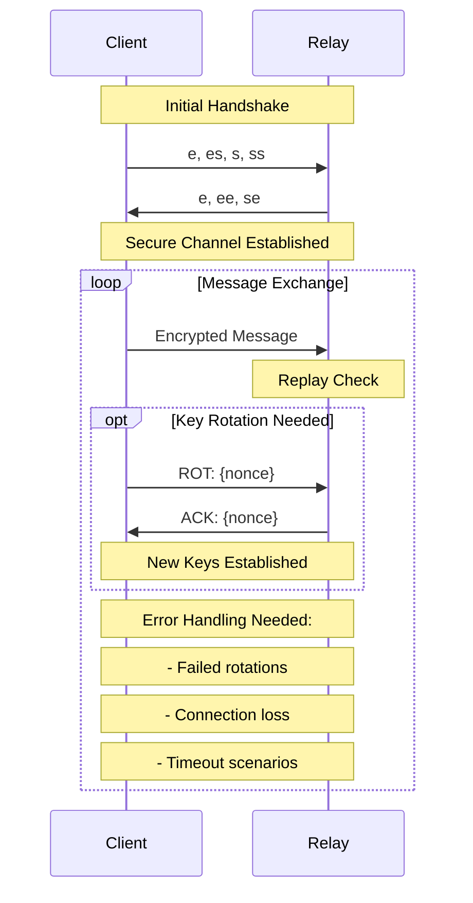

# System Patterns

## Core Architecture

### Security Layer
1. Noise Protocol Implementation
   - Pattern: IK (Interactive Key Exchange)
   - Components: 
     - NoiseConnection: Basic protocol implementation
     - SecurityContext: Security state management
   - Features: 
     - ✅ Key rotation (basic implementation)
     - 🔄 Replay protection (needs comprehensive testing)
     - ✅ Handshake management
   - Known Limitations:
     - Silent failures in edge cases
     - Missing security event logging
     - Limited error handling

2. Message Flow


### Network Architecture
1. Relay System
   - Pattern: Publisher/Subscriber
   - Components: 
     - ✅ Dashboard: Basic monitoring interface
     - ✅ Relay nodes: Basic communication
   - Features: 
     - ✅ Basic registration
     - ✅ Simple heartbeat
     - ✅ Basic status monitoring
   - Pending:
     - ❌ Persistent storage
     - ❌ Load balancing
     - ❌ Advanced routing

2. Dashboard Design
   - Pattern: MVC (Model-View-Controller)
   - Components:
     - Model: In-memory relay state (needs persistence)
     - View: Basic Flask templates
     - Controller: Basic Flask routes
   - Limitations:
     - No authentication
     - In-memory state only
     - Basic error handling

3. DNS Management
   - Pattern: Command/Adapter (RNDC/nsupdate integration)
   - Components:
     - ✅ BIND9: Basic authoritative setup
     - ❌ Unbound/CoreDNS: Not implemented
   - Features: 
     - ✅ Basic DNS management
     - ❌ Split DNS (planned)
     - ❌ Advanced features pending

4. Access Control
   - Pattern: Directory/Policy Enforcement
   - Status: Planned, not implemented
   - Pending Components:
     - Directory/auth server integration
     - Permission system
     - Zero-trust implementation

5. Internal Services & Content Distribution
   - Pattern: Microservices/Event-driven
   - Status: Planned, not implemented
   - Future Components:
     - Service infrastructure
     - Content distribution
     - App deployment system

6. Overlay & Advanced Networking
   - Pattern: Overlay/Peer-to-peer
   - Status: Planned, not implemented
   - Future Features:
     - NAT traversal
     - Mesh optimization
     - Advanced routing

### Code Organization
1. Current Module Structure
   ```
   ├── client/
   │   ├── client.py (basic implementation)
   │   ├── config.py (basic configuration)
   │   ├── dashboard_app.py
   │   └── ui-tauri/ (in progress)
   ├── dashboard/
   │   ├── dashboard.py (basic implementation)
   │   ├── dns_admin.py (basic DNS management)
   │   └── templates/
   ├── relay/
   │   ├── relay.py (basic implementation)
   │   └── bind9_alt_setup.md
   ├── scripts/
   │   ├── start_client_dashboard.py
   │   ├── start_relay.py
   │   └── start_relay_with_dashboard.py
   └── tests/
       ├── test_handshake.py (basic tests)
       └── test_integration.py (basic tests)
   ```

2. Implemented Design Patterns
   - ✅ Factory: Basic NoiseConnection creation
   - ✅ State: Basic SecurityContext management
   - 🔄 Observer: Basic relay monitoring
   - ✅ Strategy: Basic message handling

## Security Patterns

### Authentication
1. Static Key Authentication
   - ✅ Basic pre-shared static keys
   - ✅ Noise Protocol IK pattern
   - 🔄 Basic keypair management
   - Needed:
     - Robust error handling
     - Key rotation improvements
     - Security logging

2. Message Security
   - ✅ Basic replay protection window
   - ✅ Basic nonce validation
   - ✅ Basic timestamp checks
   - Needed:
     - Comprehensive testing
     - Edge case handling
     - Performance optimization

### Key Management
1. Rotation Strategy
   ```mermaid
   stateDiagram-v2
       [*] --> Active
       Active --> Rotating: Time/Message Threshold
       Rotating --> Handshaking: Init Rotation
       Handshaking --> Active: New Keys
       Handshaking --> Failed: Error
       Failed --> Active: Fallback
       Note right of Failed: Error handling needs improvement
       Note right of Rotating: Edge cases need handling
   ```

## Testing Strategy
1. Current Unit Tests (Basic Coverage)
   - ✅ Basic handshake verification
   - ✅ Basic replay protection
   - ✅ Basic key rotation
   - Needed:
     - Edge case scenarios
     - Error conditions
     - Security event logging
     - Performance testing

2. Current Integration Tests (Limited)
   - ✅ Basic end-to-end communication
   - ✅ Basic relay management
   - ✅ Basic dashboard functionality
   - Needed:
     - Multi-relay scenarios
     - Network partitioning
     - Load balancing
     - Long-running stability
     - Resource utilization

3. Missing Test Categories
   - Load testing
   - Security penetration testing
   - Scalability testing
   - Recovery scenarios
   - Error handling verification
